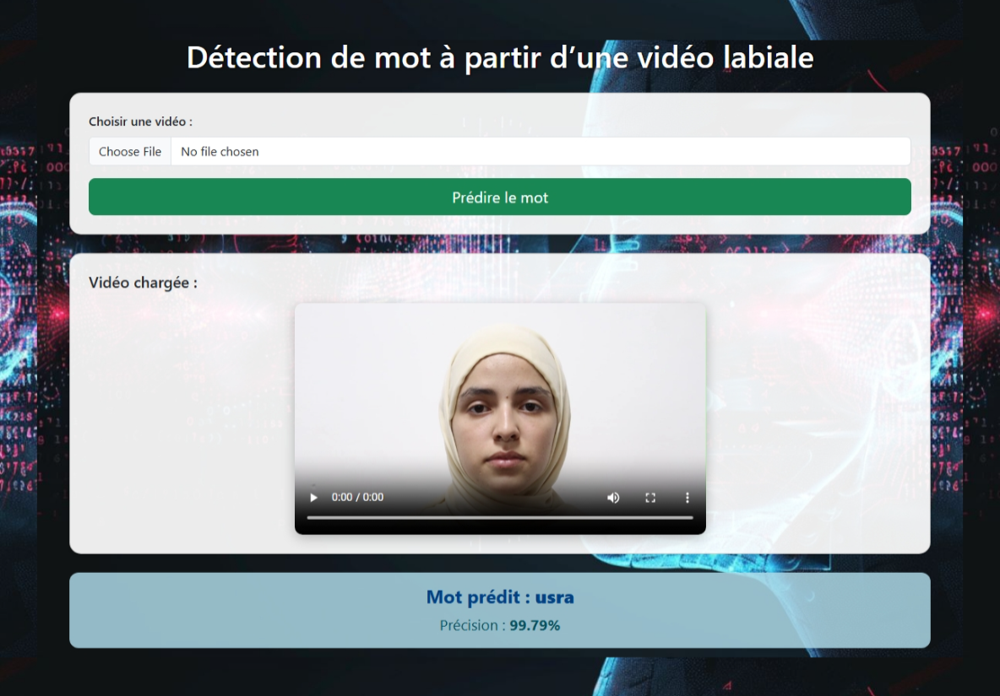

# Classification Labiale à Partir de Séquences Vidéo

Ce projet vise à entraîner un modèle de classification basé sur les mouvements des lèvres (expression labiale), à partir de séquences vidéo. L’objectif est de reconnaître automatiquement des **mots prononcés en arabe** à partir de la dynamique des lèvres seule — sans audio.

---

##  Structure du Dataset

- **Nombre de participants** : 31 personnes
- **Nombre initial d’échantillons** : 319
- **Après augmentation** : 1276 séquences
- **Format des entrées du modèle** : `(batch_size, 15, 196, 96)`  
  (15 frames par échantillon, taille normalisée à 196×96)

##  Démarche Technique

1. **Collecte des vidéos** :  
   Chaque participant a prononcé 10 mots en arabe. Les vidéos ont été enregistrées dans des conditions diverses.

2. **Extraction des frames** :  
   OpenCV a été utilisé pour extraire 15 frames par vidéo, représentant le mouvement des lèvres durant la prononciation.

3. **Prétraitement** :
   - Redimensionnement des images : 196×96
   - Séquences normalisées à 15 frames
   - Normalisation des valeurs de pixel
   - Augmentation des données pour atteindre 1276 échantillons

4. **(À venir) Extraction des landmarks labiaux** :  
   MediaPipe Face Mesh sera utilisé pour localiser précisément la zone des lèvres (468 landmarks). Pour l’instant, seules les frames ont été extraites.

5. **Organisation des données** :  
   Les données sont organisées par dossier correspondant à chaque mot (classe), prêtes pour un apprentissage supervisé.

---
## Architecture :
* Tensor de forme : (15, 196, 96, 1)
    * (15 frames par échantillon, redimensionnées, converties en niveaux de gris)
* TimeDistributed permet de traiter chaque frame indépendamment via CNN.
* LSTM capture la dynamique temporelle des séquences labiales (mouvements entre frames).
* Dense en sortie assure la classification multiclasse à 10 sorties (softmax).
---

## Classes de mots

Le dataset contient 10 classes correspondant à des mots arabes :

['akala', 'bayt', 'darasa', 'kataba', 'kitab', 'madrasa', 'qalam', 'talib', 'usra', 'bab']

---

## Exemples Visuels

Voici quelques frames représentatives de chaque classe :

### 📚 `darasa`

### 👨‍👩‍👧 `usra`

### 🚪 `bab`

## Conclusion

Ce projet a permis de mettre en place un pipeline complet de reconnaissance labiale à partir de séquences vidéo, depuis la collecte des données jusqu’à la conception d’un modèle de classification deep learning sur mesure.
En travaillant exclusivement sur les mouvements des lèvres, sans aucune information audio, nous avons pu explorer les défis liés au traitement spatio-temporel, à la préparation de séquences labiales cohérentes, et à l’apprentissage supervisé multiclasse.

---
## Auteur  
- Maroua Ourahma.
    - Email : marouaourahma@gmail.com  
    - LinkedIn : [linkedin.com/in/ourahma](www.linkedin.com/in/maroua-ourahma)

